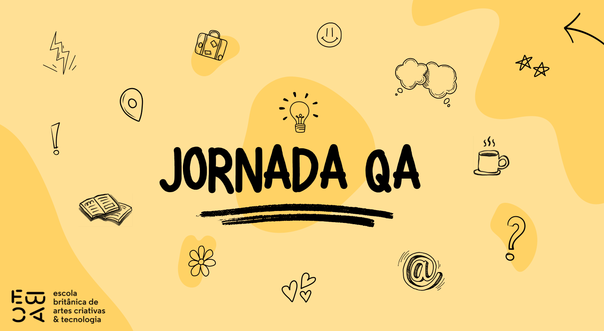

# Daily, esteira de integração contínua

## Entrega das funcionalidade na Review e reunião de Retrospectiva, gerando um plano de ação para melhoria.

### Temas do dia

- reunião de revisão(Review)
- Retrospectiva e melhorias

### TAREFA

- Preencher o formulário da Retrospectiva da Jornada: https://forms.gle/A4P2P7y72K5CghDW9
- Crie um documento com suas conclusões

  - O que você achou que mandamos bem na Jornada ( incluindo você ); O que poderia ser melhorado;
  - E o que você sugere como melhoria;
  - E uma conclusão final sobre a Jornada QA e seu processo na Jornada.

- Para entregar, basta salvar o arquivo e subir no seu Googledrive, Onedrive ou Github (pode subir de forma manual);
- Depois basta nos enviar o link pelo bot do Telegram.

**_Dica:_** A comunicação escrita do QA é essencial, portanto não deixe de concluir esta tarefa. Não deixe de revisar a ortografia.
